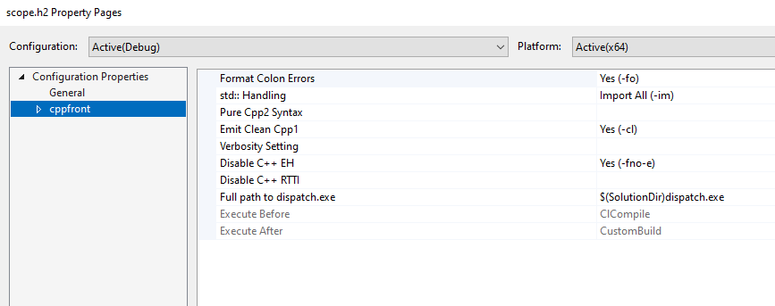

# cpp2 / cppfront binding for MS Build

An example of integrating Herb Sutter's [cppfront](https://hsutter.github.io/cppfront/) "c++2" prototype into Visual Studio's build system and IDE. Currently this example offers:

* MS Build and [premake](https://premake.github.io/) hooks to spin up a Visual Studio project with cpp2 support
* A dispatch shim tool that also runs `clang-format` on generated cpp1 code for easier reading and debugging
* A toy raytracer example project built with cpp2

## Getting Started

1. Ensure you have the *clang-cl* compiler option enabled for **Visual Studio 2022** - code generated by cppfront can frequently blow up the MSVC compiler, so we target clang by default (plus we copy out `clang-format` from the Visual Studio distribution)
2. Clone the repository, initialise submodules (`cppfront`, `fmt` and premake binaries in `/ext`)
3. Run `build/premake.bat` - this will build the dispatch tool (from `build/cpp-dispatch`), `cppfront` (from `ext/cppfront`) and copy `clang-format` into the right place

**NOTE** that you can copy over your own `cppfront.exe` build into `build/_gen`, replacing the one built from the source in `ext/cppfront` -- the tools are only built if `build/_gen/cppfront.exe` is not present.

**NOTE ALSO** that we have some custom modifications to cppfront specifically for the example project (extra metafunctions) - so if you bring your own build, you will not be able to build the example project code.

4. Load and run the solution from `build/_gen/cpp2_msbuild_vs2022.sln`; build and run to launch the raytracer - the default setup is set to use quite high sampling rates so you will need the **Release** build and plenty of CPU cores to get an image out without a long wait. The TGA result is written out next to the executable.

## MS Build support

MS Build support is provided by rules defined in `build/cpp2-msbuild`. It provides the basic dependency tracking to ensure changes are rebuilt when `.cpp2` or `.h2` files are modified. 

Options that map to cppfront command-line arguments are offered at project and file level. 

The files utilise the `dispatch` tool to provide the clang formatting post-process, but this can trivially be removed with a few small edits if you prefer calling `cppfront` directly.
